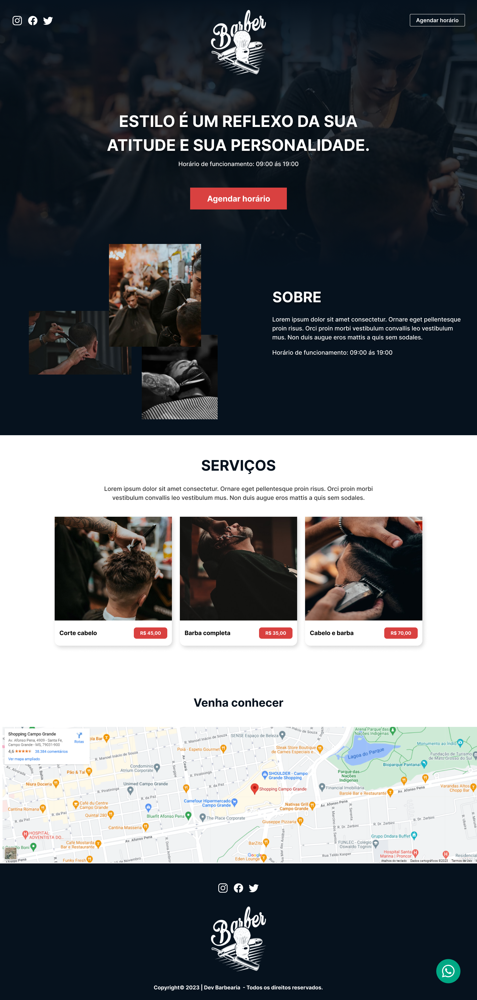

# Loadpage-Barbearia
Projeto de página de carregamento para uma barbearia, totalmente responsiva. As tecnologias utilizadas foram HTML5, CSS3, SCSS e JavaScript.

Loadpage - Desktop

</img>

Loadpage - mobile

</img>

<h2>Acesse agora a barbearia <a href="https://loadpage-barbearia.vercel.app/" target="_blank">link</a>
